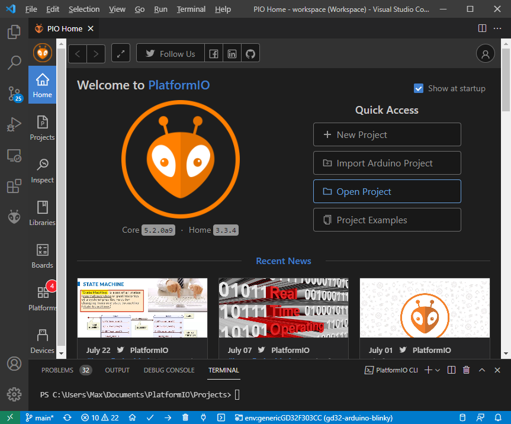
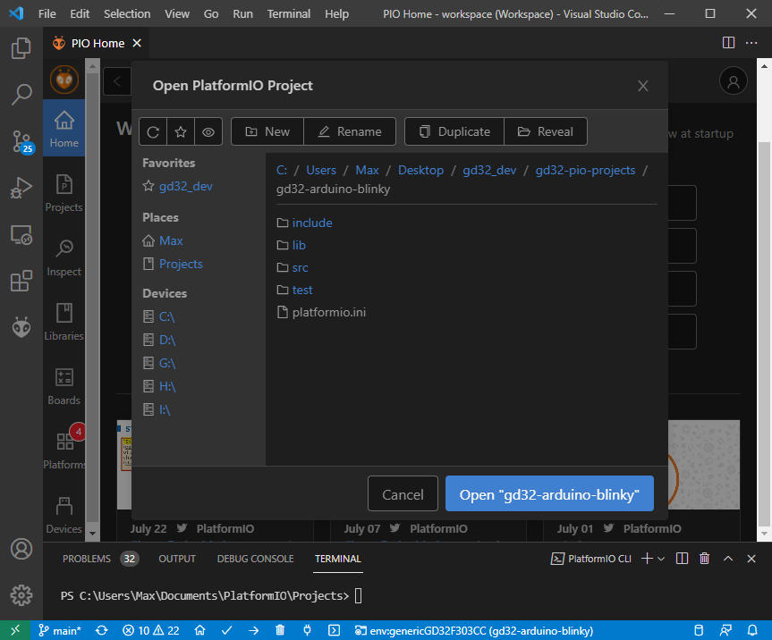
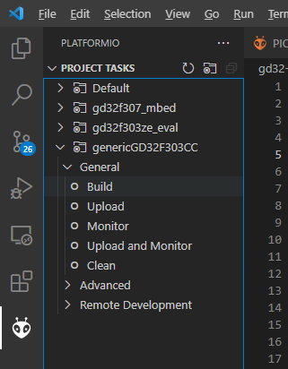

# GD32 PlatformIO Projects

 
[](https://GitHub.com/CommunityGD32Cores/GD32Core-New/pull/) [](https://GitHub.com/CommunityGD32Cores/gd32-pio-projects/issues/)

## Description

This repository contains a collection of example projects to be used with the newly developed [GD32 PlatformIO integration](https://github.com/CommunityGD32Cores/platform-gd32). The examples range from using the [new Arduino core](https://github.com/CommunityGD32Cores/ArduinoCore-GD32/), the [SPL framework](https://github.com/CommunityGD32Cores/gd32-pio-spl-package) or being baremetal projects.

## General Usage Notes

As these are PlatformIO projects, the PlatformIO documentation at https://docs.platformio.org/ always applies. Especially useful are the [Getting started with VSCOde + PlatformIO](https://docs.platformio.org/en/latest/integration/ide/vscode.html#installation), [CLI reference](https://docs.platformio.org/en/latest/core/index.html) and [platformio.ini options](https://docs.platformio.org/en/latest/projectconf/index.html) pages. 

## Importing Examples

It is assumed that you have either installed VSCode + PlatformIO or PlatformIO on the CLI following the documentation above. As a first step, clone this repository in an arbitrary folder.

```sh
git clone https://github.com/CommunityGD32Cores/gd32-pio-projects/
```

When using VSCode, open the PIO Home screen, e.g. via [the toolbar](https://docs.platformio.org/en/latest/integration/ide/vscode.html#platformio-toolbar). Use the "Open Project" open to navigate to one of the projects in the repository that you just cloned, e.g., `gd32-arduino-blinky`.




After opening the project, trust the VSCode workspace in the popup dialog. Your workspace should now contain the new project.

## Board selection

The available boards for an example are listed in the `platformio.ini` file of the project. For each board, there is an `[env:board]` section describing the build parameters. Refer to the documentation linked above for detailed information. 

For example, the `gd32-arduino-blinky` project contains 

```ini
[env]
platform = https://github.com/CommunityGD32Cores/platform-gd32.git
monitor_speed = 115200

[env:gd32f307_mbed]
board = gd32f307_mbed
framework = arduino

[env:gd32f303ze_eval]
board = gd32f303ze_eval
framework = arduino

[env:genericGD32F303CC]
board = genericGD32F303CC
framework = arduino
```

Thus these 3 boards are available.

The available `board` values are the boards available in [the platform](https://github.com/CommunityGD32Cores/platform-gd32/tree/main/boards). Note that not every board supports every framework (e.g., Arduino) at the moment, but all e.g. support SPL.

In VSCode, to select a certain board environment (and project), you **must** use the [project environment switcher](https://docs.platformio.org/en/latest/integration/ide/vscode.html#project-tasks) in the bottom blue taskbar. Make sure your wanted board and project are selected before continuing. After selecting a new environment, the IntelliSense will be reloaded, which might take a bit.

For CLI users, the target environment is given as the `-e` switch in the `pio run` command, see [documentation](https://docs.platformio.org/en/latest/core/userguide/cmd_run.html).

## Compiling

In VSCode, use the [project tasks](https://docs.platformio.org/en/latest/integration/ide/vscode.html#project-tasks) list in the left PIO sidebar as normal to trigger the "Build" action, or a different action, for a certain environment. The environment you have previously selected as your default will be the expanded one.



For CLI users, executue the `pio run -e <environment>` command, as documentend above.

Compilation should result in a success, e.g.: 

```text
> pio run -e genericGD32F303CC
CONFIGURATION: https://docs.platformio.org/page/boards/gd32/genericGD32F303CC.html
PLATFORM: GD GD32 (1.0.0+sha.bbcdaa1) > GD32F303CC (48k RAM. 256k Flash)
HARDWARE: GD32F303CCT6 120MHz, 48KB RAM, 256KB Flash     
DEBUG: Current (stlink) External (blackmagic, cmsis-dap, 
jlink, stlink)
PACKAGES:
 - framework-arduinogd32 4.20000.210603+sha.c50499f      
 - toolchain-gccarmnoneeabi 1.90201.191206 (9.2.1)       
LDF: Library Dependency Finder -> http://bit.ly/configure-pio-ldf
LDF Modes: Finder ~ chain, Compatibility ~ soft
Found 9 compatible libraries
Scanning dependencies...
No dependencies
Building in release mode
Compiling .pio\build\genericGD32F303CC\FrameworkArduinoVariant\PeripheralPins.c.o
..
Linking .pio\build\genericGD32F303CC\firmware.elf
Checking size .pio\build\genericGD32F303CC\firmware.elf
Advanced Memory Usage is available via "PlatformIO Home > Project Inspect"
RAM:   [          ]   0.8% (used 412 bytes from 49152 bytes)     
Flash: [          ]   3.8% (used 9904 bytes from 262144 bytes)   
Building .pio\build\genericGD32F303CC\firmware.bin
================== [SUCCESS] Took 5.01 seconds ==================
```

## Uploading

Note that the default upload method and available upload method is listed in the board manifest, e.g. for the [GD32F303CC board](https://github.com/CommunityGD32Cores/platform-gd32/blob/bbcdaa192cde7609d3da77e389eacd4f3d6c335e/boards/genericGD32F303CC.json#L43-L51), `stlink` is the default, attempting to upload via a ST-Link probe connected to the chip via SWD, using OpenOCD as tool. JLink, CMSIS-DAP, BMP, serial and USB-DFU (experimental) upload methods are available as well. To change the upload method, change [`upload_protocol`](https://docs.platformio.org/en/latest/projectconf/section_env_upload.html#upload-protocol) accordingly. SWD based upload methods can also be used as [`debug_tool`](https://docs.platformio.org/en/latest/projectconf/section_env_debug.html#debug-tool) for live-debugging. 

For VSCode users, use the project task "Upload".

For CLI users, use `pio run -t upload -e <environment>` as documented above.

Example of upload:

```
Configuring upload protocol...
AVAILABLE: blackmagic, cmsis-dap, dfu, jlink, serial, stlink
CURRENT: upload_protocol = stlink
Uploading .pio\build\genericGD32F303CC\firmware.elf
xPack OpenOCD, x86_64 Open On-Chip Debugger 0.11.0-00155-ge392e485e (2021-03-15-16:44)
Licensed under GNU GPL v2
For bug reports, read
        http://openocd.org/doc/doxygen/bugs.html
debug_level: 1

hla_swd
0x2ba01477
target halted due to debug-request, current mode: Thread 
xPSR: 0x01000000 pc: 0x08003c0c msp: 0x2000c000
** Programming Started **
Warn : STM32 flash size failed, probe inaccurate - assuming 512k flash
** Programming Finished **
** Verify Started **
** Verified OK **
** Resetting Target **
shutdown command invoked
============================================================================================= [SUCCESS] Took 4.06 seconds =============================================================================================
```

## Serial Monitor

For examples using serial output, you need to connect a USB-UART converter to the board and target UART pin to be able to observe it. In the case of Arduino and the GD32F303CC chip, the default serial is on UART1, TX = PA2, RX = PA3. Note that the UART adapter and the target board should also share a common GND connection.

To access the serial montior in VSCode, execute the "Monitor" project task, as shown above.

To access it from the CLI, execute [`pio device monitor`](https://docs.platformio.org/en/latest/core/userguide/device/cmd_monitor.html).

The monitor is aborted by pressing the standard Ctrl+C combination.

Settings like the baud rate or adapter to use (if not auto-detected) are to be found in the [monitor section](https://docs.platformio.org/en/latest/projectconf/section_env_monitor.html) of the `platformio.ini`.

Example:

```
> Executing task in folder gd32-arduino-blinky: C:\Users\Max\AppData\Local\Programs\Python\Python38\Scripts\platformio.exe device monitor --environment genericGD32F303CC <

--- Available filters and text transformations: colorize, debug, default, direct, hexlify, log2file, nocontrol, printable, send_on_enter, time
--- More details at http://bit.ly/pio-monitor-filters
--- Miniterm on COM3  115200,8,N,1 ---
--- Quit: Ctrl+C | Menu: Ctrl+T | Help: Ctrl+T followed by Ctrl+H ---
Blinky nr. 0
Blinky nr. 1
Blinky nr. 2
Blinky nr. 3

--- exit ---
```