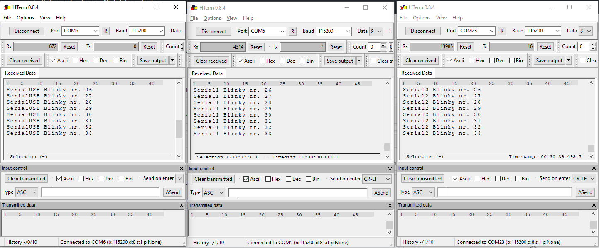

# Arduino Serial Example

## Description 

This example shows how to use multiple serial ports that are available on an Arduino-enabled boards at the same time.

Remember that:
* a chip usually has multipe U(S)ART peripherals (USART0, USART1, USART2, UART3, UART4, ...)
* in our Arduino core, the USART0 peripheral is exposed as the `Serial1` object (first hardware serial), going on with `Serial2` (USART1) et cetera
* `Serial` is a macro for either
  * the USB CDC (Serial) if it is enabled (only for F30x series boards, see `genericGD32F303CC_with_CDC` environment)
  * the default hardware serial (which for the generic variants is `Serial1`)
* the default pins for these serials can be found in the `variant.h` of the used variant, as e.g. seen in [this variant](https://github.com/CommunityGD32Cores/ArduinoCore-GD32/blob/39df5b09e22b84c559bd0a09208e04338dcf7b0e/variants/GD32F130C8_GENERIC/variant.h#L110-L132)

```cpp
/* "Serial" is by default Serial1 / USART0 */
#ifndef DEFAULT_HWSERIAL_INSTANCE
#define DEFAULT_HWSERIAL_INSTANCE   1
#endif

/* USART0 */
#define HAVE_HWSERIAL1
#ifndef SERIAL0_RX
#define SERIAL0_RX                  PA10
#endif
#ifndef SERIAL0_TX
#define SERIAL0_TX                  PA9
#endif

/* USART1 */
#define HAVE_HWSERIAL2
#ifndef SERIAL1_RX
#define SERIAL1_RX                  PA3
#endif
#ifndef SERIAL1_TX
#define SERIAL1_TX                  PA2
#endif
```
* the default pins for `Serial1` would be TX=PA9, RX=10, and for `Serial2`, TX=PA2, RX=PA3

As you can see, all these macros for pins and the default serial are `#ifndef` guarded and can thus be overriden by global macros. For example, if you whish to have Serial1 (=USART0) rather use the pins TX=PB6, RX=PB7, you can write

```ini
build_flags =
   -DSERIAL0_TX=PB6
   -DSERIAL0_TX=PB7
```
in the `platformio.ini` for your specific environment (`[env:xyz]`).

Note that you cannot use arbitrary pins here, for `SERIAL0_TX` and `RX`, belonging to USART0, you have to use pins that the USART0 peripheral can use. What pins these are depend on the chip. It can also be looking up in the `PeripheralPins.c` files of the variant, [for example this one](https://github.com/CommunityGD32Cores/ArduinoCore-GD32/blob/39df5b09e22b84c559bd0a09208e04338dcf7b0e/variants/GD32F130C8_GENERIC/PeripheralPins.c#L184-L202):

```cpp
/* UART_TX PinMap */
const PinMap PinMap_UART_TX[] = {
    {PORTA_2,  USART1, GD_PIN_FUNCTION4(PIN_MODE_AF, GPIO_OTYPE_PP, PIN_PUPD_PULLUP, IND_GPIO_AF_1)}, /* USART1_TX */
    {PORTA_8,  USART1, GD_PIN_FUNCTION4(PIN_MODE_AF, GPIO_OTYPE_PP, PIN_PUPD_PULLUP, IND_GPIO_AF_4)}, /* USART1_TX */
    {PORTA_9,  USART0, GD_PIN_FUNCTION4(PIN_MODE_AF, GPIO_OTYPE_PP, PIN_PUPD_PULLUP, IND_GPIO_AF_1)}, /* USART0_TX */
    {PORTA_14, USART1, GD_PIN_FUNCTION4(PIN_MODE_AF, GPIO_OTYPE_PP, PIN_PUPD_PULLUP, IND_GPIO_AF_1)}, /* USART1_TX */
    {PORTB_6,  USART0, GD_PIN_FUNCTION4(PIN_MODE_AF, GPIO_OTYPE_PP, PIN_PUPD_PULLUP, IND_GPIO_AF_0)}, /* USART0_TX */
    {NC,   NC,    0}
};

/* UART_RX PinMap */
const PinMap PinMap_UART_RX[] = {
    {PORTA_3,  USART1, GD_PIN_FUNCTION4(PIN_MODE_AF, GPIO_OTYPE_PP, PIN_PUPD_PULLUP, IND_GPIO_AF_1)}, /* USART1_RX */
    {PORTA_10, USART0, GD_PIN_FUNCTION4(PIN_MODE_AF, GPIO_OTYPE_PP, PIN_PUPD_PULLUP, IND_GPIO_AF_1)}, /* USART0_RX */
    {PORTA_15, USART1, GD_PIN_FUNCTION4(PIN_MODE_AF, GPIO_OTYPE_PP, PIN_PUPD_PULLUP, IND_GPIO_AF_1)}, /* USART1_RX */
    {PORTB_0,  USART1, GD_PIN_FUNCTION4(PIN_MODE_AF, GPIO_OTYPE_PP, PIN_PUPD_PULLUP, IND_GPIO_AF_4)}, /* USART1_RX */
    {PORTB_7,  USART0, GD_PIN_FUNCTION4(PIN_MODE_AF, GPIO_OTYPE_PP, PIN_PUPD_PULLUP, IND_GPIO_AF_0)}, /* USART0_RX */
    {NC,   NC,    0}
};
```

So for USART0 we really only have 2 pin choices, and for USART1 in this case 4.

This example also contains a UART bridge test that, if enabled through `DO_BRIDGE_TEST` in `main.cpp`, transfer all data from Serial1 to Serial2 and vice versa.

## Expected outout

For the regular blinky + print test, all activated serials (hardware UARTs and USB serial if activated), should output text.

Example for the GD32F303CC with USB CDC enabled:

