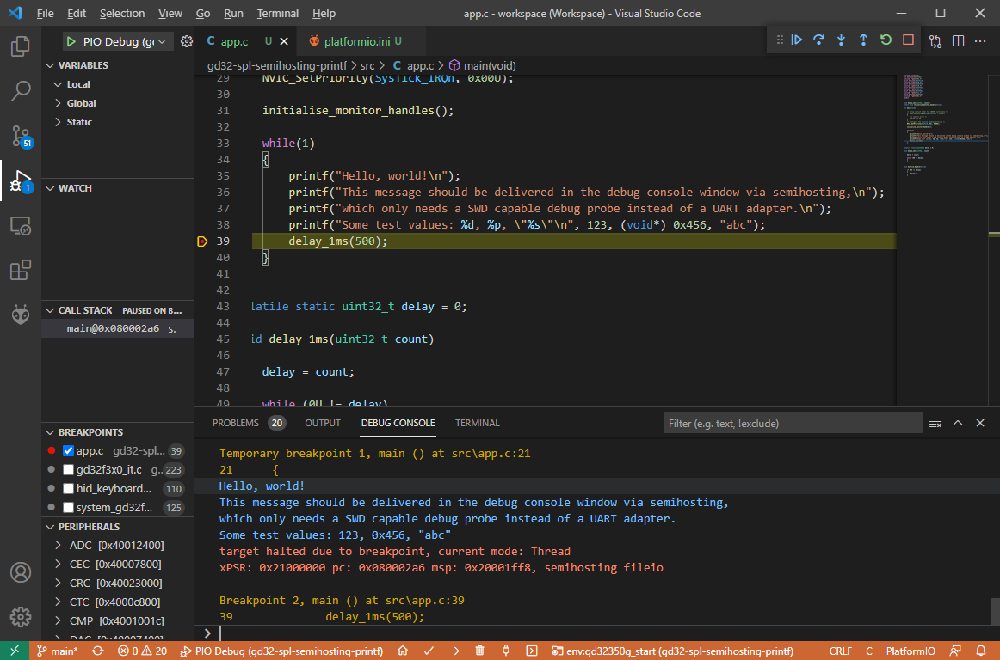

# Semihosting printf() example

## Description

This example makes use of the semihosting capabilities of the SWD probe. No USB-UART Converter is needed.

The `platformio.ini` does

```
board_debug.semihosting = yes
debug_extra_cmds = 
    monitor arm semihosting enable
    monitor arm semihosting_fileio enable
```

the first triggers the SPL builder script to link in the library required for semihosting (makes `initialise_monitor_handles()` available), the second directive extends the GDB initialization commands to activate semihosting output in OpenOCD. 

To view the printf output, the firmware must be started in debug mode. This is explained in the main readme page of this repository. After debugging has started, switch to the "Debug Console" view in VSCode. Then, set a breakpoint at the `delay_1ms(500);` line and let the firmware advance to this point (play button). Once the firmware hits that breakpoint, the `printf()` output should appear in the debug console tab.




The "Monitor" project task in PlatformIO will **not** show the printf() output, since that starts `miniterm.py` as the serial monitor, which needs a serial port device or a network port to connect to, which this firmware does not provide. We are however looking into creating a small helper script that exposes the SWD semihosting output on a e.g. network port so that the monitor task will work.