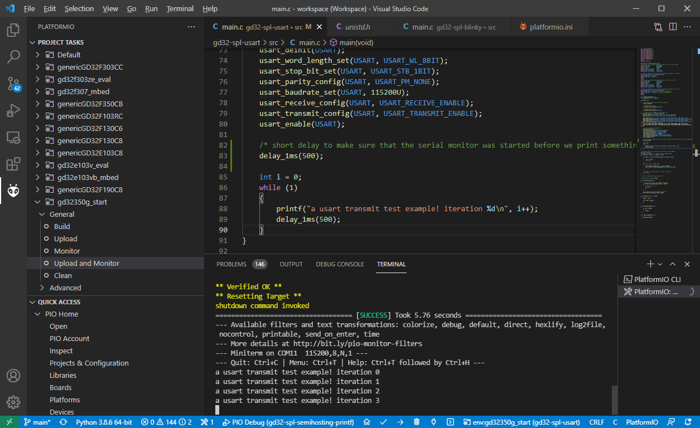

# SPL USART printf() example

## Description 

This example project shows how to implement the necessary functions so that `printf()` output is directed to the USART peripheral and thus observable on the serial monitor.

## Technicalities

To make this work, the firmware needs to implement a low-level C library function responsible for writing data to a target file descriptor, `int _write(int fd, char* data, int len)`. The file descriptor number will be 1 for the standard-out (`stdout`, `STDOUT_FILENO`), 2 for `stderr` and 0 for `stdin`. The implementation of `_write` is then responsible for transporting the data in whatever way it needs to. Obviously, we choose to write the data out via USART here.

The implemention does it as follows:

```cpp
int _write(int file, char *data, int len)
{
    if ((file != STDOUT_FILENO) && (file != STDERR_FILENO))
    {
        errno = EBADF;
        return -1;
    }

    for (int i = 0; i < len; i++)
    {
        usart_data_transmit(USART, (uint8_t)data[i]);
        while (RESET == usart_flag_get(USART, USART_FLAG_TBE))
            ;
    }

    // return # of bytes written - as best we can tell
    return len;
}
```

**Note** that existing original SPL examples by GigaDevice do not do this, they implement `fputc()` instead, and must be adapted in the above way to work with GCC.

## UART settings

This example code initializes the USART0 peripheral to send at 115200 baud and the standard 8 databits, no parity, 1 stopbit ("8N1") configuration. 

The example has the capability to choose between two sets of UART pins, since one some hardware one set of pins may be unaccesible or statically connected to e.g. VCC or GND. Without any activated macros, the UART output will be on TX = PA9, RX = PA10. When the `USE_ALTERNATE_USART0_PINS` macro is defined, e.g. via a [`build_flags`](https://docs.platformio.org/en/latest/projectconf/section_env_build.html#build-flags) directive, the output will be on TX = PB6, RX = PB7.

Some development boards do not have a USB-UART converter / adapter on board, so you need to make sure to connect one yourself to the right pins. That is,
* GND (adapter) <--> GND (board)
* RX (adapter) --> TX (board)
* TX (adapter) --> RX (board ) [only needed if you want to send data to the board, not necessary for observing output]

Note that PlatformIO's serial monitor can be extensively configured per [documentation](https://docs.platformio.org/en/latest/projectconf/section_env_monitor.html). The most important settings are 
* `monitor_speed = ...`: setting the baud rate at which the serial adapter will be opened. Misconfiguring this value will lead to garbage characters being printed.
* `monitor_port = ...`: If PlatformIO automatic serial port detection logic fails you, you can specify the serial port device (e.g., `COM9`, `/dev/ttyUSB0`) here. Usually this is not necessary.

## Observing the output

To observe the outout, follow the `README` of this repo to build and upload the application. To then start the serial monitor in VSCode, use the [project task](https://docs.platformio.org/en/latest/integration/ide/vscode.html#project-tasks) "Monitor".

A handy shortcut though is the "Upload and Monitor" project task, doing a build, upload and starting the serial monitor all with one single click. 



The same can be achieved using the commandline. For a stand-alone serial monitor (after the firmware has already been uploaded), the command [`pio device monitor`](https://docs.platformio.org/en/latest/core/userguide/device/cmd_monitor.html) can be used. However, the same shortcut as in VSCode can be used, doing a build + upload + monitor in one go, by using multiple `-t` (target) switches in the standard [`pio run`](https://docs.platformio.org/en/latest/core/userguide/remote/cmd_run.html) command, with `pio run -e <environment name> -t upload -t monitor`. 

```
> pio run -e gd32350g_start -t upload -t monitor
Processing gd32350g_start (board: gd32350g_start; framework: spl; platform: https://github.com/CommunityGD32Cores/platform-gd32.git)
[...]
** Verified OK **
** Resetting Target **
shutdown command invoked
============================================================================================= [SUCCESS] Took 5.66 seconds =============================================================================================
--- Available filters and text transformations: colorize, debug, default, direct, hexlify, log2file, nocontrol, printable, send_on_enter, time
--- More details at http://bit.ly/pio-monitor-filters
--- Miniterm on COM11  115200,8,N,1 ---
--- Quit: Ctrl+C | Menu: Ctrl+T | Help: Ctrl+T followed by Ctrl+H ---
a usart transmit test example! iteration 0
a usart transmit test example! iteration 1
a usart transmit test example! iteration 2
...
```

Note that there may be some delay between PlatformIO having flashed the firmware and it opening the serial monitor. Insert a small delay at the beginning of the firmware to counteract this. This firmware already does that.