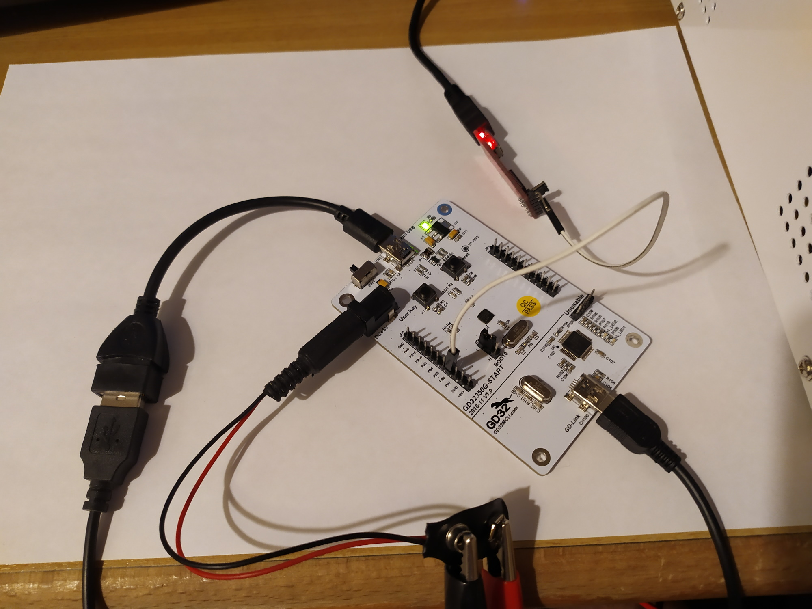

# SPL USB Host HID example

## Description

This an example firmware adapted from `GD32F3x0_Firmware_Library_V2.1.1\Examples\USBFS\USB_Host\usb_host_hid_keyboard_mouse\`.

It allows a USB HID device (a keyboard or a mouse) to be connected to the microcontroller.

**Note**: For the keyboard demo, if `PIO_USB_HOST_HID_FULL_STATE_INFO_CALLBACK` is activated in the `platformio.ini`, a QWERTZ layout decoding is performed. Otherwise, a QWERTY layout is used.

## Pinout

This USB example is currently primarily supporting these boards: 
* GD32350G-START
* GD32350R-EVAL

However, it can be easily expanded for other GD32F3x0 boards. Important things are:

1. The `HOST_POWERSW_x` definitions in `gd32f3x0_usb_hw.c`. It defines the GPIO pin which is driven by microcontroller to allow the USB bus to be powered. This pin is usually connected to PNP transistor which itself is connected between +5V and VBUS of the USB port.
2. For `usbh_usr.c` it interacts with a button via a GPIO pin and the functions `gd_eval_key_init()` and `gd_eval_key_state_get()`. These are supplied in the board support package files for a GigaDevice-made development board, but can also be self-supplied if the target board is not a GigaDevice development board

As for the main text output of the firmare, the file `printf_over_x.c` implements transporting `printf()` output via
* UART0 (TX=PA9)
* UART0 (TX=PB6) (if the macro `USE_ALTERNATE_USART0_PINS` is set)
* SWD Semihosting (if the macro `PRINTF_VIA_SEMIHOSTING` is set)

It is highly recommended to use UART for the output since semihosting is extremely slow and blocking and can thus disturb USB bus operations.

Alternative UART pins are implemented since some boards (such as the GD32350G-START) have the default PA9 output pin connected to somewhere else, non-accessible. See the [gd32-spl-usart](https://github.com/CommunityGD32Cores/gd32-pio-projects/tree/main/gd32-spl-usart#uart-settings) page for more detailed information.

Lastly, it is important to notice that for most development boards from GigaDevice, power to the USB bus can only be supplied via a barrel-jack connector on the board and not one of the USB ports (the other USB port for the GDLink does not feed power into the board). Consult your board's schematic / user manual for more information. In the case of e.g. the [GD32350G-START schematics](https://github.com/CommunityGD32Cores/gigadevice-firmware-and-docs/blob/main/GD32F3x0/GD32F3x0_Demo_Suites_V2.1.0/GD32350G_START_Demo_Suites/Docs/Schematic/GD32350G-START-V1.0.pdf), one can see that +5V and GND must be supplied to the barrel-jack connector CN4, e.g. from an external lab-bench power supply or a spliced-up USB cable. *Carefully* inspect the polarities before connecting an external power source to the board, by e.g. measuring contuinity to a GND pin.

Additionally, since most boards feature a USB mini-B plug that is connected to the main microcontroller, a converter cable to a female USB-A jack is needed to be able to plug a e.g. USB keyboard into it.

## Media

Example setup with a GD32350G-START board, powered by a lab-bench power supply at 5.0V. The power switch next the barrel-jack connector is additionally set to the left position ("power from barrel-jack"). An external USB-UART converter is additionally connected to PB6. The common GND is implicit since the GDLink of the board is connected to the same USB hub as the USB-UART converter and thus they share the same GND. A USB mini-B to USB-A (female) converter cable is used to be able to plug a USB device into the board.



## Example output

When connecting a keyboard and is commented out `PIO_USB_HOST_HID_FULL_STATE_INFO_CALLBACK` in the `platformio.ini`:

```
USB Host HID firmware start!
USB host library started
> Reset the USB device.
> Low speed device detected.
> Device Attached.
VID: 0x1A2C
PID: 0x2124
> HID device connected.
Manufacturer: SEM
Product: USB Keyboard
> Enumeration completed.
---------------------------------------
To start the HID class operations:
Press User Key...
> HID Demo Device : Keyboard.
> Use Keyboard to type characters:
> Keyboard pressed: 'A' (41)
> Keyboard pressed: 'B' (42)
> Keyboard pressed: 'C' (43)
> Keyboard pressed: 'D' (44)
> Keyboard pressed: 'E' (45)
> Keyboard pressed: 'F' (46)
> Keyboard pressed: 'G' (47)
> Device Disconnected.
```

When connecting a keyboard and `PIO_USB_HOST_HID_FULL_STATE_INFO_CALLBACK` is active in the `platformio.ini`

```
USB Host HID firmware start!
USB host library started
> Reset the USB device.
> Low speed device detected.
> Device Attached.
VID: 0x1A2C
PID: 0x2124
> HID device connected.
Manufacturer: SEM
Product: USB Keyboard
> Enumeration completed.
---------------------------------------
To start the HID class operations:
Press User Key...
> HID Demo Device : Keyboard.
> Use Keyboard to type characters:
Pressed Keys (scancodes): 4 5 6
Pressed Keys (symbol): A B C
Modifier Keys: lshift
< all keys released >
```

In the above mode, one can also press the user key (on demo boards also labeled "User Key") to switch to a primitive "write text" mode. The input keys are not debounced, so double-typing characters can easily occur. For simple demonstration purposes only.

```
== ENTERED WRITE TEXT MODE ==
> Start typing on the keyboard
> And the text shall be saved and displayed.
...
Write buffer (11 bytes):
Hello world
Write buffer (12 bytes):
Hello world!
```

When connecting a mouse:

```
USB Host HID firmware start!
USB host library started
> Reset the USB device.
> Low speed device detected.
> Device Attached.
VID: 0x046D
PID: 0xC077
> HID device connected.
Manufacturer: Logitech
Product: USB Optical Mouse
> Enumeration completed.
---------------------------------------
To start the HID class operations:
Press User Key...
> HID Demo Device : Mouse.
Mouse left button pressed
Mouse left button released
Mouse right button pressed
Mouse right button released
New mouse position: X=0, Y=-1 (delta 1,-1)
New mouse position: X=0, Y=-2 (delta 1,-1)
New mouse position: X=0, Y=-3 (delta 1,-1)
New mouse position: X=0, Y=-3 (delta 1,0)
New mouse position: X=0, Y=-4 (delta 1,-1)
New mouse position: X=-1, Y=-5 (delta -1,-1)
New mouse position: X=-2, Y=-5 (delta -2,1)
New mouse position: X=-3, Y=-5 (delta -1,0)
New mouse position: X=-4, Y=-5 (delta -1,0)
New mouse position: X=-5, Y=-5 (delta -1,0)
```