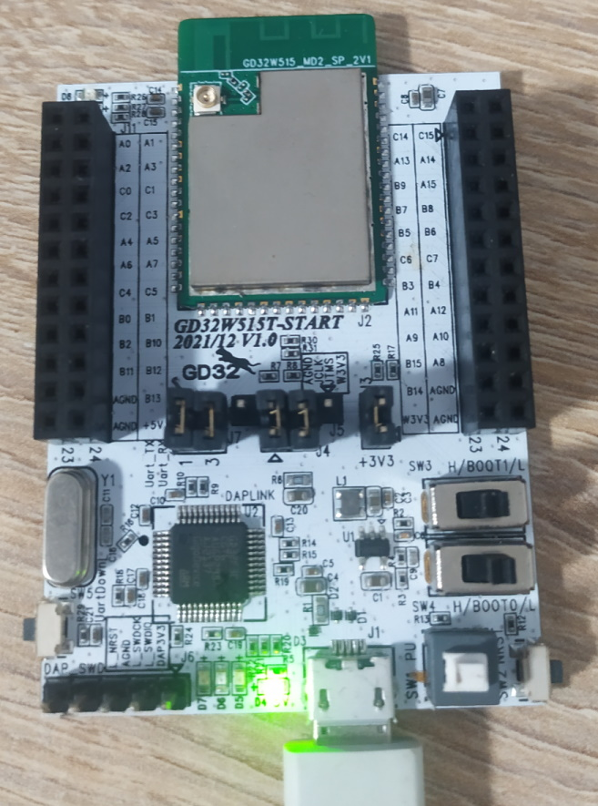

# W51x WiFi Demo

## Description 

This example project the command shell example of the Gigadevice WiFi SDK.

It is by default configured for the GD32W515T-START board.

## Hardware

Just connect the GD32W515T-START board via USB to the computer.



## Example Output

The initial boot output should be

```
GIGA DEVICE
MBL: Boot from Image 0.
SDK first message for GDM32W51x
SDK git revision: 1.0.2-3a343ba2642a1b7f 
SDK version: V1.0.2
SDK build date: Oct 29 2022 18:50:58

System reset mode: pin,
System clock is 180000000
WiFi SW init OK.
WiFi RF init OK.
WiFi BB config OK.
WiFi RF calibration OK.
WiFi MAC address: 76:ba:ed:1e:00:f6
wifi netlink: device opened!

#
```

As indicated by the `#`, a command console is now open. Typing `help` gives all supported commands:

```sh
# help
COMMAND LIST:
==============================
    wifi_open
    wifi_close
    wifi_scan
    wifi_set_ip
    wifi_connect
    wifi_disconnect
    wifi_status
    wifi_rssi
    wifi_set_channel
    wifi_mac_addr
    wifi_ps
    wifi_ap
    wifi_ap_adv
    wifi_stop_ap
    mem_status
    ping
    join_group
    telnet
    iperf
    iperf3
    ssl_client
    ssl_selftest
    exit
    wifi_set_bw
    reboot
    help
```

The following example shows how to connect to a WiFi and execute a ping to the standard Google DNS server (8.8.8.8).

```sh
# wifi_connect
Usage: wifi_connect SSID [PASSWORD]
#
# wifi_connect MY_WIFI_SSID MY_WIFI_PASSWORD
STA: Auth SAE commit sent with status 0.
STA: Auth SAE commit received.
STA: Auth SAE confirm sent with status 0.
STA: Auth SAE confirm received.
STA: Assoc Request sent to 78:6a:1f:3b:b6:31.
STA: Assoc Response received with status 0.
STA: Receive Eapol 4-1.
STA: Send Eapol 4-2.
STA: Receive Eapol 4-3.
STA: Send Eapol 4-4.
wifi netlink: indicate connect, link_status is 2.
wifi netlink: connected to ap: MY_WIFI_SSID
wlan_handle_amsdu: get recvframe failed
wifi netlink: Got IP  192.168.0.117
wlan_handle_amsdu: get recvframe failed
wlan_handle_amsdu: get recvframe failed
wlan_handle_amsdu: get recvframe failed
wlan_handle_amsdu: get recvframe failed
Enter wifi ps.
wlan_handle_amsdu: get recvframe failed
wlan_handle_amsdu: get recvframe failed
wlan_handle_amsdu: get recvframe failed
wlan_handle_amsdu: get recvframe failed
wlan_handle_amsdu: get recvframe failed

# wifi_status
WIFI Status: Connected
==============================
MODE:        STATION
SSID:        MY_WIFI_SSID
CHANNEL:     11
BW:          20M
MODE:        N
SECURITY:    WPA2/WPA3
BSSID:       78:6a:1f:3b:XX:XX
RSSI:        -47 dbm

Network Interface Status
==============================
MAC:         [76:ba:ed:1e:00:f6]
IP:          [192.168.0.117]
GW:          [192.168.0.1]

# ping 8.8.8.8
[ping_test] PING 8.8.8.8 120 bytes of data
[ping_test] 68 bytes from 8.8.8.8: icmp_seq=1 time=80 ms
[ping_test] 68 bytes from 8.8.8.8: icmp_seq=2 time=100 ms
[ping_test] 68 bytes from 8.8.8.8: icmp_seq=3 time=71 ms
[ping_test] 68 bytes from 8.8.8.8: icmp_seq=4 time=88 ms
[ping_test] 68 bytes from 8.8.8.8: icmp_seq=5 time=86 ms
[ping_test] 5 packets transmitted, 5 received, 0% packet loss
[ping_test] delay: min 71 ms, max 100 ms, avg 85 ms
```

# Sidenotes

This project also demonstrates how to use a custom configuration folder / headers to set the application size to ~2 MByte instead of the default ~1 MByte. This of course disabled any OTA possibilities for a 2MByte flash.

Note that the bootloader (at 0x800000, 40960) can currently not be disabled to be built. Further, for functions stored in ROM, the first 0x200 (512) bytes are reserved.